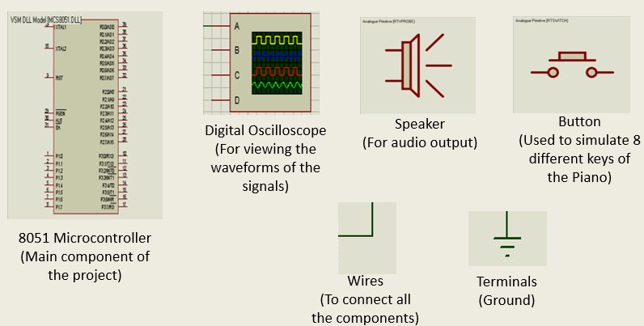
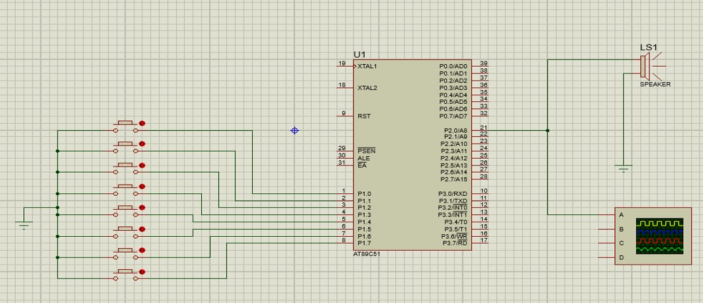
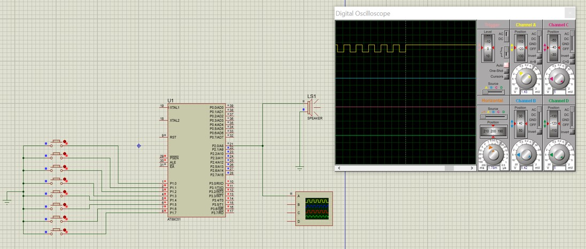

# 8 keys piano using 8051 microcontroller
 
<b>Introduction:</b> 
The piano is a musical instrument played mainly by means of a keyboard. It is one of the most popular instruments in the world.
The rhythmic organization is based on rhythmic patterns called Taal. The melodic foundations are called ragas. One possible classification of ragas is into “melodic modes” or “parent scales”, known as Thaats, under which most ragas can be classified based on the notes they use.
That may consist of up to seven scale degrees, or swara. Hindustani musicians name these pitches using a system called Sargam, the equivalent of Western movable do solfege:<pre> 
Sa (Shadaj) = Do 
Re (Rishab) = Re 
Ga (Gandhar) = Mi 
Ma (Madhyam) = Fa 
Pa (Pancham) = So 
Dha (Dhaivat) = La 
Ni (Nishad) = Ti 
Sa (Shadaj) = Do </pre>
Both systems repeat at the octave. The difference between sargam and solfege is that re, ga, ma, dha, and ni can refer to either “Natural” (Shuddha) or altered “Flat” (Komal) or “Sharp” (Tivra) versions of their respective scale degrees. As with movable do solfege, the notes are heard relative to an arbitrary tonic that varies from performance to performance, rather than to fixed frequencies, as on a xylophone. 
<b>In this project we are generating the same frequencies which are exactly same as sa re ga ma pa dha ni sa by using the controller.</b>

<b>Components used:</b> 

<b>Circuit Diagram:</b>

<b>Output for key2:</b>

<b>Other output screenshots: </b>https://github.com/likhitaavl2k/8-keys-piano-using-8051-microcontroller/blob/main/MPMC%20Documentation(MiniProject).pdf

<b>PPT: </b> https://github.com/likhitaavl2k/8-keys-piano-using-8051-microcontroller/blob/main/Mini%20Project%20PPT.pptx

<b>Software Requirements:</b> 
1. Keil MicroVision 3 (Generation of hex code)
2. Proteus 8 Professional (Schematic Capture) for simulation.